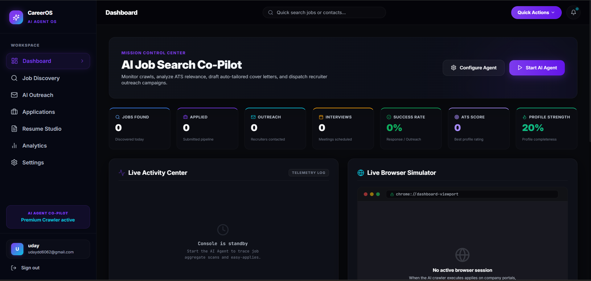

<div align="center">


<br /><br />

# CareerOS V2 — Premium AI Job Search Operating System

**A premium, dark-mode glassmorphic SaaS platform that automates and optimizes your job application lifecycle. Features automated web crawlers, AI resume tailored matching, custom Gmail outreach campaigns, drag-and-drop pipelines, and interactive telemetry dashboards.**

[📸 View Screenshot](#screenshots) · [⚙️ Quick Start](#-setup--running-locally) · [🧠 Features](#-features) · [🔌 API reference](#-api-endpoints)

</div>

---

## 🚀 What is CareerOS V2?

**CareerOS V2** transitions the chaotic job search process into a highly automated, unified command center (modeled after platforms like Teal, Huntr, and LoopCV). 

Powered by a dual-agent architecture (crawler + tailoring model), the platform automatically finds relevant jobs across 50+ portals, matching them against your parsed resumes using deep semantic alignment, drafting tailored cover letters, and dispatching recruiter outreach followups directly via Google APIs.

---

## 📸 Screenshots

### 🏠 AI Job Command Center (Dashboard)
> Live session logs, enqueued metrics, active crawler telemetry, and real-time Playwright browser simulator viewport streaming.



---

## ✨ Features

| Module | Description |
| :--- | :--- |
| **🏠 Command Center** | Real-time session activity, live logging, and browser simulator screenshots streamed via Socket.IO. |
| **🔍 Job Discovery Split-View** | Multi-portal aggregator with advanced filters, match score indicators, and assisted apply accordion (Cover Letters, screening answers, recruiter drafts). |
| **📬 Gmail-style Outreach Hub** | Track sent outreach threads, monitor open/reply metrics, customize pending drafts, and send directly via Gmail API. |
| **📋 Kanban Application Pipeline** | Standard drag-and-drop board (Saved, Applied, Interview, Offer, Rejected) powered by native HTML5 APIs and instant MDB updates. Includes Table and Timeline views. |
| **📊 Interactive SVG Analytics** | Weekly application volumes, conversion funnel rings, open rate trendlines, and ATS score progressions built from raw SVGs (zero bundle weight). |
| **📄 Resume Studio** | PDF keyword parsing, ATS match recommendations, and Overleaf-compatible LaTeX code compilers. |
| **⚙️ Autopilot Settings** | Autopilot toggles, daily submit quotas, schedule calendars, Telegram notification hooks, and Stripe billing simulators. |

---

## 🛠️ Technology Stack

* **Frontend**: React 18, Vite, Zustand, Tailwind CSS, Lucide Icons, Framer Motion.
* **Backend**: Node.js, Express (ESM), Socket.IO (real-time logs/simulator), Mongoose.
* **Concurrency & Queueing**: BullMQ (Redis-backed queues for scraping, matching, and mailing).
* **Automation**: Playwright (autonomous chromium sessions for LinkedIn and Indeed crawling).
* **AI Engine**: OpenRouter (Gemini 2.0 Flash) & DeepSeek (ATS matching and cover letter tailored generation).
* **Mail Channel**: Gmail API via Google OAuth 2.0.

---

## ⚙️ Setup & Running Locally

### Prerequisites
- Node.js (v18+)
- MongoDB (Atlas URI or Local Instance)
- Redis Server (Required for BullMQ queue operations)
- Google Cloud Console Credentials (OAuth 2.0 Client for Login & Gmail API)

### 1. Clone & Install Dependencies

```bash
# Clone the repository
git clone https://github.com/your-username/ai-applyer.git
cd ai-applyer

# Install Backend Dependencies
cd backend
npm install

# Install Frontend Dependencies
cd ../frontend
npm install
```

### 2. Configure Environment Variables

Create a `.env` file in the **backend** directory:
```env
PORT=5000
NODE_ENV=development

# Database & Redis
MONGO_URI=your_mongodb_atlas_connection_string
REDIS_URL=redis://localhost:6379

# AI & Job API keys
OPENROUTER_API_KEY=your_openrouter_api_key
DEEPSEEK_API_KEY=your_deepseek_api_key
RAPIDAPI_KEY=your_jsearch_rapidapi_key

# Google OAuth Credentials
GOOGLE_CLIENT_ID=your_google_oauth_client_id
GMAIL_CLIENT_SECRET=your_google_oauth_client_secret
FRONTEND_URL=http://localhost:5173
```

Create a `.env` file in the **frontend** directory:
```env
VITE_API_URL=http://localhost:5000
VITE_GOOGLE_CLIENT_ID=your_google_oauth_client_id
```

### 3. Google OAuth Setup
To allow authentication and Gmail outreach to work locally:
1. Visit [Google Cloud Console Credentials](https://console.cloud.google.com/).
2. Under your OAuth 2.0 Web Application client:
   - Add to **Authorized JavaScript origins**: `http://localhost:5173`
   - Add to **Authorized redirect URIs**: `http://localhost:5173/gmail-callback` and `http://localhost:5000/api/auth/google`
3. Save the credentials and enable the **Gmail API** for your project.

### 4. Execute Servers

Start your local Redis server first. Then run the backend and frontend in separate terminals:

```bash
# Terminal 1: Backend Dev Server
cd backend
npm run dev

# Terminal 2: Frontend Dev Server
cd frontend
npm run dev
```

- **Frontend App**: [http://localhost:5173](http://localhost:5173)
- **Backend API**: [http://localhost:5000](http://localhost:5000)

---

## 🔌 API Endpoints

### Auth & User Profile
- `POST /api/auth/register` - Create user
- `POST /api/auth/login` - Authenticate & return JWT
- `POST /api/auth/google` - Exchange Google Token & authenticate
- `GET /api/auth/me` - Profile metadata

### Resumes & AI Studio
- `GET /api/resumes` - List resumes
- `POST /api/resumes/upload` - Upload PDF
- `POST /api/ai/parse-resume/:id` - Extract resume skills & metadata
- `POST /api/ai/latex-resume` - Compile LaTeX template

### Job Discoveries & Pipelines
- `GET /api/jobs` - List enqueued pipeline applications
- `POST /api/jobs/auto-apply` - Match, score, and create application log
- `PUT /api/jobs/:id/status` - Update pipeline state (Kanban drag-and-drop)

### Gmail Outreach
- `GET /api/outreach/gmail/auth-url` - Generate Google permissions prompt
- `POST /api/outreach/gmail/callback` - Authenticate Gmail refresh tokens
- `POST /api/outreach/generate-draft` - Generate follow-up template body
- `POST /api/outreach/send-outreach` - Send Gmail email
- `GET /api/outreach/stats` - Fetch aggregate email open/reply counters
- `GET /api/outreach/history` - Fetch sent thread logs

---

## 🙋 Maintainer
Developed by **Uday Kiran** — Senior UI/UX and MERN Software Engineer.
